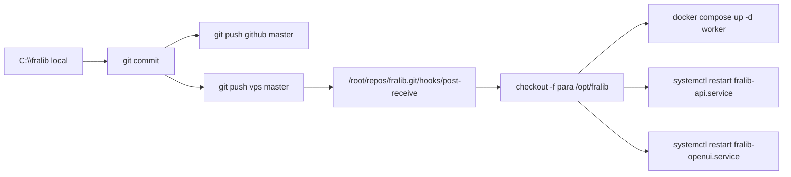
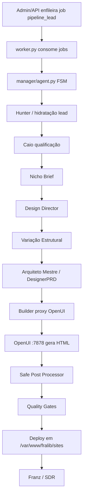

# FraLib — Manual Canônico de Produção

Última atualização: 2026-08-13  
Ambiente validado: VPS Comercial `104.243.41.166` / domínio `https://app.seunegociofralib.site`

Este é o documento principal do projeto. Se outro `.md` contradizer este arquivo, este arquivo vence.

## Regra de Ouro para IAs e Desenvolvedores

1. Não crie arquivos paralelos quando já existir módulo oficial.
2. Não crie `tmp_*`, `fix_*`, `_debug_*`, `_test_*`, `server_v2*`, `server_new*` ou variações.
3. Não edite código direto na VPS. O fluxo correto é local → commit → push → hook de deploy.
4. Não recrie pipeline, builder, renderer ou servidor. Melhore os arquivos oficiais.
5. Antes de remover ou mover algo, prove que não há import ativo com `rg`.
6. Depois de qualquer mudança na pipeline, rode testes e um E2E real com lead do tenant 2.

## Visão Geral

FraLib é um SaaS multi-tenant que:

- captura ou reaproveita leads locais;
- qualifica o lead;
- pesquisa mercado e imagens;
- cria uma direção visual própria;
- gera HTML via OpenUI;
- valida técnica/criativamente;
- publica o site em Nginx;
- prepara o lead para SDR/WhatsApp.

## Produção Real

| Componente | Runtime oficial | Caminho | Observação |
|---|---|---|---|
| API | systemd `fralib-api.service` | `/opt/fralib/server.py` | FastAPI porta `8001` |
| Worker | Docker `fralib-worker-1` | `/opt/fralib/worker.py` | Consome tabela `jobs` |
| OpenUI | systemd `fralib-openui.service` | `/opt/fralib/openui-wandb/backend/openui/generate.py` | Porta `7878` |
| Postgres | Docker `fralib-postgres-1` | volume Docker | Banco `fralib_db`, user `fralib_user` |
| Redis | Docker `fralib-redis-1` | volume Docker | Cache/fila auxiliar |
| Sites publicados | Nginx/static | `/var/www/fralib/sites/` | URL `/sites/<tenant>/<slug>/` |
| Código fonte na VPS | Git checkout | `/opt/fralib/` | Atualizado pelo hook |
| Bare repo da VPS | Git remote | `/root/repos/fralib.git` | Recebe `git push vps master` |

## Fluxo de Deploy



O hook atual também roda `git clean -fd` em `/opt/fralib`. Não dependa de arquivos soltos não versionados na pasta do projeto.

### Sincronização Especial do OpenUI

O código versionado do OpenUI fica em:

```text
openui-service-wandb/backend/openui/generate.py
```

O runtime real do systemd usa:

```text
/opt/fralib/openui-wandb/backend/openui/generate.py
```

Depois de mudar o OpenUI, sincronize o arquivo versionado para o runtime real na VPS:

```bash
install -m 0644 /opt/fralib/openui-service-wandb/backend/openui/generate.py \
  /opt/fralib/openui-wandb/backend/openui/generate.py
systemctl restart fralib-openui.service
```

## Pipeline Real de Produção



### Cadeia de Custódia Visual

Cada etapa deve preservar e registrar decisões visuais:

```text
niche_brief
→ creative_direction
→ variation_blueprint
→ designer_prd
→ openui_payload
→ openui_html
→ post_processed_html
→ final_html
```

Arquivos centrais:

| Etapa | Arquivo oficial | Responsabilidade |
|---|---|---|
| FSM | `backend/agents/manager/agent.py` | Ordem real da pipeline |
| Estado | `backend/agents/manager/states.py` | Campos da cadeia visual |
| Nicho | `backend/agents/manager/step_nicho.py` | Brief de nicho/público |
| Direção | `backend/agents/manager/step_design_director.py` | Conceito, paleta, tipografia |
| Variação | `backend/agents/manager/step_variacao.py` | Ordem/composição estrutural |
| PRD | `backend/agents/manager/step_arquiteto.py` | Gera `DesignerPRD` |
| Builder | `backend/agents/manager/step_builder.py` | Monta payload para OpenUI |
| OpenUI client | `backend/agents/builder/agent.py` | Chama `/generate` no OpenUI |
| OpenUI runtime | `openui-service-wandb/backend/openui/generate.py` | Prompt e HTML bruto |
| Safe post | `backend/agents/cinematic_post_processor.py` | Só correções técnicas seguras |
| QA/Gates | `backend/agents/manager/step_quality_gate.py` | Technical, Creative, Diversity |
| Fingerprint | `backend/agents/visual_fingerprint.py` | Assinatura visual do site |
| Deploy | `backend/agents/manager/step_deploy.py` | Salva HTML final e metadata |
| Artifacts | `backend/agents/artifact_store.py` | Salva evidências por etapa |

## Gates Ativos

| Gate | Objetivo | Falha quando |
|---|---|---|
| Technical Gate | HTML renderizável e estruturalmente válido | Falta `<main>`, `<h1>`, seções, conteúdo visível |
| Creative Compliance Gate | Decisão visual protegida chegou até o HTML | Falta fingerprint/custódia/mídia obrigatória |
| Visual Diversity Gate | Evitar sites iguais, especialmente no mesmo nicho | Similaridade acima de `FRALIB_VISUAL_DIVERSITY_THRESHOLD` |

O QA Vision rigoroso pode existir, mas não deve substituir os gates determinísticos.

## OpenUI e Contrato Visual

O OpenUI é o gerador de HTML. Ele deve receber:

- `openui_payload`;
- `creative_direction`;
- `variation_blueprint`;
- `DesignerPRD`;
- `media_plan` com URL real, role, section e required;
- contratos hard/soft;
- SEO, FAQ, LGPD, OG e schema quando disponíveis.

Hard constraints não podem ser violadas:

- conceito visual;
- paleta;
- tipografia;
- hero type;
- section order;
- media roles;
- anti-patterns.

Soft constraints orientam, mas podem ser adaptadas pelo OpenUI.

## Safe Post Processor

`backend/agents/cinematic_post_processor.py` roda em modo `safe_only=True` no deploy.

Ele pode:

- garantir shell HTML válido;
- normalizar Tailwind/head técnico;
- remover armadilhas de invisibilidade;
- corrigir problemas técnicos seguros.

Ele não pode:

- trocar background;
- trocar cores;
- trocar fontes;
- alterar layout/composição;
- mudar spacing/radius;
- trocar imagens;
- transformar visual em outro design.

## Observabilidade e Diagnóstico

Fontes oficiais:

```sql
SELECT id, status, attempts, last_phase, left(coalesce(last_error,''), 500)
FROM jobs
ORDER BY id DESC
LIMIT 10;
```

```sql
SELECT *
FROM pipeline_error_log
ORDER BY created_at DESC
LIMIT 10;
```

```sql
SELECT id, nome, status, site_url, erro_pipeline
FROM leads
WHERE user_id = 2
ORDER BY atualizado_em DESC
LIMIT 10;
```

Logs úteis:

```bash
docker logs fralib-worker-1 --tail 160
journalctl -u fralib-openui.service --no-pager -n 120
journalctl -u fralib-api.service --no-pager -n 120
```

## Comandos de Produção

### Saúde

```bash
ssh -i ~/.ssh/id_ed25519 root@104.243.41.166
docker ps --format "table {{.Names}}\t{{.Status}}"
systemctl is-active fralib-api.service
systemctl is-active fralib-openui.service
curl -I https://app.seunegociofralib.site/health
```

### Verificar runtime importado pelo worker

```bash
docker exec fralib-worker-1 python -c "
import inspect
import backend.agents.manager.agent as m
import backend.agents.builder.agent as b
print(inspect.getfile(m))
print([s.__name__ for s in m.PIPELINE_STEPS])
print(inspect.getfile(b))
"
```

### Enfileirar reprocessamento pelo admin

Use o `admin.html` sempre que possível. Ele deve chamar os endpoints em `backend/endpoints/pipeline_endpoints.py`, que enfileiram `pipeline_lead` na tabela `jobs`.

Endpoint oficial para reprocessar lead existente:

```http
POST /api/pipeline/reprocessar/{lead_id}
```

Requisitos:

- usuário autenticado;
- tenant correto;
- créditos/cooldown liberados;
- worker Docker healthy;
- OpenUI active.

### E2E de validação com lead real

1. Escolha lead do tenant 2:

```sql
SELECT id, nome, cidade, segmento, status, site_url
FROM leads
WHERE user_id = 2
ORDER BY atualizado_em DESC
LIMIT 20;
```

2. Dispare pelo admin ou endpoint.
3. Monitore:

```sql
SELECT id, status, attempts, last_phase, left(coalesce(last_error,''), 500)
FROM jobs
ORDER BY id DESC
LIMIT 5;
```

4. Valide URL:

```bash
curl -k -L -s -o /tmp/site.html -w "%{http_code} %{size_download}\n" \
  https://app.seunegociofralib.site/sites/2/<slug>/
grep -oi "<main\b" /tmp/site.html | wc -l
grep -oi "<section\b" /tmp/site.html | wc -l
grep -oi "<h1\b" /tmp/site.html | wc -l
grep -oi "`;
- `1` `<h1>`;
- `>= 6` seções para site comercial completo;
- imagens reais;
- OG, FAQ e LGPD presentes;
- `jobs.status = completed`;
- `leads.status = concluido`;
- `leads.erro_pipeline` vazio.

## Testes Locais

Antes de commit:

```powershell
pytest tests/unit/test_builder_prd_spec.py `
  tests/unit/test_manager_intent_pipeline.py `
  tests/unit/test_openui_handoff_safe_post.py `
  tests/unit/test_visual_fingerprint_quality_gates.py -q
```

Suíte completa:

```powershell
pytest tests/unit/ -v
```

Se a suíte completa parar em `JWT_SECRET_KEY inseguro`, corrija o `.env` local para usar chave com 32+ bytes. Isso é falha de ambiente, não da pipeline visual.

## O Que é Produção

| Produção | Não duplicar |
|---|---|
| `server.py` | `server_v2.py`, `server_new.py` |
| `worker.py` | worker paralelo systemd |
| `backend/agents/manager/*` | orquestrador alternativo |
| `backend/agents/builder/agent.py` | renderer paralelo |
| `openui-service-wandb/backend/openui/generate.py` | OpenUI improvisado |
| `backend/agents/cinematic_post_processor.py` safe-only | pós-processador visual agressivo |
| `backend/agents/visual_fingerprint.py` | gate de diversidade duplicado |
| `backend/core/job_queue.py` | fila paralela |

## O Que é Legado

Arquivos legados foram arquivados em:

```text
backend/_arquivo/services/
```

Inclui:

- `openui_renderer.py`;
- `pipeline_executors.py`;
- `pipeline_fases/`;
- `pipeline_prompt_agent.py`;
- `pipeline_prd_builder.py`;
- `pipeline_builders.py`;
- `vite_react_renderer.py`;
- `builder_worker.py`;
- `openui_contracts.py`.

Eles existem para consulta histórica. Não importe esses arquivos na produção.

Outros documentos antigos em `docs/` podem estar desatualizados. Use este `README.md` e `AGENTS.md` como fonte de verdade.

## Estrutura do Sistema

```text
C:\fralib
├── server.py                         # FastAPI oficial
├── worker.py                         # Worker oficial da fila jobs
├── docker-compose.prod.yml           # Worker/Postgres/Redis em produção
├── backend
│   ├── agents
│   │   ├── manager                   # FSM oficial da pipeline
│   │   ├── builder                   # Cliente OpenUI
│   │   ├── visual_fingerprint.py     # Fingerprint/diversity
│   │   ├── cinematic_post_processor.py
│   │   ├── artifact_store.py
│   │   └── _arquivo                  # Legado arquivado
│   ├── core                          # DB, auth, job_queue, rate_limit
│   ├── endpoints                     # API FastAPI
│   └── services                      # Serviços auxiliares ativos
├── frontend                          # admin.html e UI
├── openui-service-wandb              # OpenUI versionado
├── docs                              # Histórico, specs e consultas
└── tests                             # Testes unitários/integrados
```

## Última Validação E2E

Data: 2026-08-13  
Lead: `Legacy Centro de Treinamento`  
Tenant: `2`  
Job: `480`  
Resultado: `completed`, `attempts=1`  
URL: `https://app.seunegociofralib.site/sites/2/legacy-centro-de-treinamento-b0b7a7c0/`

HTML validado:

- HTTP `200`;
- `36426` bytes;
- `1` `<main>`;
- `8` `<section>`;
- `1` `<h1>`;
- `9` ``;
- `11` referências `images.unsplash.com`;
- OG, FAQ e LGPD presentes;
- `erro_pipeline` limpo após sucesso.

## Lições Aprendidas

- Tela preta vinha de HTML/CSS/JS pós-geração e contratos visuais mal preservados.
- OpenUI não deve receber prompt genérico; precisa receber payload protegido.
- Não exija tokens OKLch literais no HTML final se o renderer implementa visual via classes/hex; valide por fingerprint/custódia.
- O pós-processador não pode redesenhar site.
- Jobs com erro devem falhar e liberar a fila; nunca travar eternamente.
- `erro_pipeline` precisa ser preenchido no erro e limpo no sucesso.
- Arquivos de cache (`__pycache__`, `.pytest_cache`, `.pyc`) nunca devem ser rastreados.
- `.env` real com segredos não deve ser committado em novos trabalhos; use exemplos sanitizados.

## Procedimento Antes de Mudar Código

1. Leia este `README.md`.
2. Leia `AGENTS.md`.
3. Rode `rg` para achar o arquivo oficial.
4. Confirme que não existe implementação pronta antes de criar qualquer arquivo.
5. Faça alteração mínima.
6. Rode testes específicos.
7. Commit local.
8. Push `github master` e `vps master`.
9. Verifique serviços.
10. Rode E2E real se tocou pipeline.

Se uma mudança parecer exigir “novo pipeline”, “novo builder” ou “novo renderer”, pare. A resposta quase sempre é corrigir o fluxo oficial já existente.
