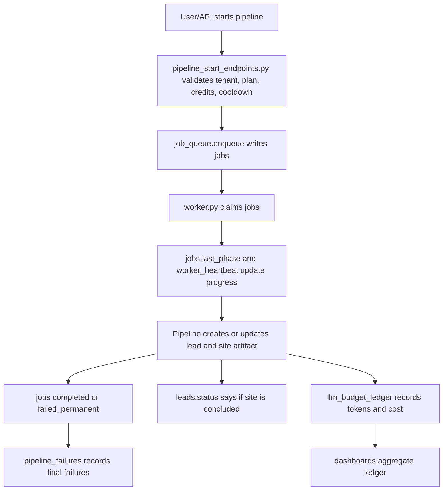

# FraLib One Truth Canonical State

This is the first document to read when changing pipeline, queue, billing,
Lead Supply, LLM cost, health or dashboard behavior.

## Like Explaining To A Child

Imagine FraLib as a school.

Every important thing needs one official notebook. If two notebooks say
different things, nobody knows who is right. So we chose one official notebook
for each subject.

- The official notebook for "what is running" is `jobs`.
- The official notebook for "what failed forever" is `pipeline_failures`.
- The official notebook for "which leads are waiting to be used" is
  `lead_inventory`.
- The official notebook for "is this lead site ready" is `leads.status`.
- The official notebook for "which plan this user has" is `users.plano`.
- The official notebook for "how many tokens and dollars LLM used" is
  `llm_budget_ledger`.
- The official notebook for "is the system healthy" is `/health`.
- The official notebook for "did a controlled production test pass" is
  `jobs` plus the published artifact and visual QA evidence.
- The official notebook for "which LLM runtime to use" is LiteLLM/proxy from env
  and canonical model aliases.

Old notebooks may still exist, but they cannot be the boss. They are kept only
so we can compare, audit, migrate or support old data.

## Golden Rule

Do not let a legacy field overwrite or decide a canonical field.

If a dashboard, worker, endpoint, script or agent needs to decide behavior, it
must read the canonical source below.

| Domain | Canonical source | Legacy/compat only |
| --- | --- | --- |
| Queue and execution | `jobs` | `pipeline_queue` |
| Final failures | `pipeline_failures.job_id` linked to `jobs.id` | loose error text in old queue rows |
| Current phase | `jobs.last_phase` | `pipeline_state.rodando` |
| Worker liveness | `jobs.worker_heartbeat` | PM2-only guesses |
| Manual pause | `pipeline_state.pausado` | `pipeline_state.rodando` |
| Lead inventory | `lead_inventory.status` | `leads.pipeline_stage` |
| Produced site state | `leads.status` | `leads.pipeline_stage` |
| User plan | `users.plano` | `users.plan` |
| LLM runtime | `LITELLM_API_KEY`, `LITELLM_BASE_URL`, proxy aliases | `provider_keys` as active router in prod |
| LLM cost/tokens | `llm_budget_ledger` | `pipeline_token_usage` |
| HTTP health | `/health` | `/api/version` |
| Controlled test result | `jobs`, `leads.status`, published `dist`, QA screenshot/evidence | chat-only claims |

## What Was Changed

1. Pipeline start no longer creates `pipeline_queue` rows.
2. Pipeline status derives `rodando`, current job and current phase from `jobs`.
3. Metrics, alerts and Hermes use `jobs` and `/health`.
4. `pipeline_state.rodando` is compatibility/audit only.
5. Stale pipeline recovery uses `job_queue.reap_dead_workers`.
6. Lead Supply has a safe stale-lock reaper for `lead_inventory`.
7. Billing decisions must use `users.plano`; `users.plan` mirrors for compat.
8. LLM dashboards and token tracking aggregate from `llm_budget_ledger`.
9. When `LITELLM_API_KEY` exists, LiteLLM/env wins before `provider_keys`.
10. `/health` returns the canonical service health payload.
11. `scripts/audit_one_truth.py` audits conflicts without changing data.
12. `scripts/reconcile_one_truth.py` reconciles only with explicit `--apply`.
13. `scripts/pipeline_harness.py` is the safe local dry-run bench.
14. `scripts/controlled_pipeline_run.py` is the real production existing-lead
    bench and skips WhatsApp by default.

## Correct Runtime Path



## How A Developer Or AI Should Work

1. Read `AGENTS.md`.
2. Read this document.
3. Read `docs/SYSTEM_OPERATIONS_MAP.md`.
4. Search current code before trusting old docs.
5. If changing behavior, update tests and docs in the same branch.
6. Run the safe checks.
7. Commit and push. Do not edit VPS files directly.

## Safe Checks

Local, no LLM/deploy/WhatsApp:

```bash
python pipeline.py smoke --dry-run
python scripts/audit_one_truth.py --pretty
python scripts/reconcile_one_truth.py
python -m pytest -q tests/unit/test_pipeline_route_contract.py tests/unit/test_security_scalability_contract.py tests/unit/test_job_queue_feedback.py --confcutdir=tests/unit --no-cov
```

When local Postgres is not running, `audit_one_truth.py` and
`reconcile_one_truth.py` may return `database_unavailable`. That is allowed for
local development. In production, run them after deploy to inspect real data.

## Reconciliation Rules

Dry-run first:

```bash
python scripts/reconcile_one_truth.py
```

Apply only after reviewing the JSON:

```bash
python scripts/reconcile_one_truth.py --apply
```

The reconciliation must not:

- overwrite `leads.status='concluido'`;
- make `pipeline_queue` active again;
- use `users.plan` as winner over `users.plano`;
- hide LLM calls outside `llm_budget_ledger`;
- mutate VPS files outside the Git flow.

## What Still Happens After Deploy

After this branch reaches production:

1. Verify `/health`.
2. Run `scripts/audit_one_truth.py --pretty` against production DB.
3. Review divergences.
4. Run `scripts/reconcile_one_truth.py` in dry-run.
5. Apply only if the JSON is expected.
6. Run one controlled pipeline job.
7. Run visual QA on the published site.
8. Watch `jobs`, `pipeline_failures`, `lead_inventory`, `leads.status` and
   `llm_budget_ledger`.

## Conflict Rule

If any older doc says `pipeline_queue`, `pipeline_state.rodando`,
`users.plan`, `pipeline_token_usage` or `/api/version` is the source of truth,
that doc is historical. This document and current code win.
