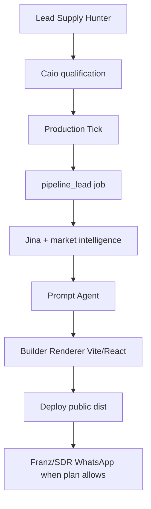

# FraLib System Operations Map

This document explains how FraLib is expected to work in production and where
to look when it does not.

## Sources Of Truth

- Local source: `C:\fralib`.
- VPS checkout: `/root/fralib`.
- Public deploy target: managed by the deploy hook, not by manual copy.
- Runtime rules: `AGENTS.md`.
- Documentation index: `docs/DOCS_INDEX.md`.
- Canonical runtime state: `docs/ONE_TRUTH_CANONICAL_STATE.md`.

## Top-Level Repository Map

- `backend/`: API, agents, services, core database/queue/auth and endpoints.
- `frontend/`: public/admin UI, landing partials and browser-side scripts.
- `scripts/`: operational scripts, smoke, validation, VPS setup and audits.
- `tests/`: unit and integration contracts.
- `docs/`: product, operations, legal, security and architecture docs.
- `openspec/`: proposed and active change specifications.
- `alembic/`: database migrations.
- `worker.py`: PM2 worker daemon for long-running jobs.
- `server.py`: API entrypoint.
- `pipeline.py`: official operational CLI.
- `ecosystem.config.js`: PM2 process definitions.
- `Dockerfile` and `docker-compose.yml`: container/dev-staging runtime.

Local caches, coverage folders, checkpoints, logs and pytest temp folders are
not product source.

## Runtime Processes

| Process | Purpose | Health evidence |
| --- | --- | --- |
| `fralib` | FastAPI/API/frontend backend on port 8000 | `/health`, `/api/version` |
| `fralib-worker` | Claims and executes jobs from Postgres | job heartbeat, PM2 logs |
| `fralib-bryan-worker` | Legacy PM2 name for SDR worker duties | PM2 status/logs |
| `fralib-hermes-watchdog` | Watchdog, incident scan, scheduled dry-run canary and Guard-approved remediation | PM2 status, `hermes_incidents` |
| `meowhats` | WhatsApp bridge on port 3001 | port check, WhatsApp endpoints |
| Postgres | canonical production database | connection and schema checks |
| Redis | rate limit/session support when configured | health/smoke |

`/health` is the canonical runtime probe. It checks DB, worker queue, Meowhats
and LiteLLM; protected internal services are probed with environment-provided
headers, not anonymous requests. LiteLLM is probed through `/models` because
the proxy `/health` endpoint can time out while chat/model routing is usable.

## Request-To-Site Flow

1. User clicks start in the app.
2. `pipeline_start_endpoints.py` validates auth, tenant, plan, credits, cooldown,
   WhatsApp and active jobs.
3. It enqueues a canonical `jobs` row.
4. `worker.py` claims the job with `SELECT FOR UPDATE SKIP LOCKED`.
5. Worker runs the job type and sends heartbeat during blocking work.
6. Pipeline phases produce lead, prompt, site artifact and deployment.
7. Billing/credit state is revalidated before lead consumption.
8. The dashboard derives progress from `jobs`, `pipeline_failures` and
   `pipeline_state.pausado`.

## Active Pipeline

## Queue And Concurrency

- Queue table: `jobs`.
- Claim logic: `backend/core/job_queue.py`.
- Pipeline job types: `pipeline_lead`, `pipeline_multiplos`, `pipeline_main`.
- Lead supply job types: `lead_supply_hunter`, `lead_supply_caio`,
  `lead_production_tick`.
- One running pipeline per tenant is enforced in `claim_next`.
- Global concurrency is controlled by `MAX_PIPELINES_GLOBAL`.
- Retries use bounded backoff and permanent failures go to failure reporting.

## Billing Flow

Mercado Pago is the only billing provider.

1. User selects plan or recharge.
2. Frontend calls `credits_endpoints.py`.
3. Backend creates Preapproval for subscriptions or Checkout Preference for
   recharge.
4. Mercado Pago redirects user to checkout.
5. Webhook or authenticated sync reconciles payment.
6. `credits_manager.py` applies plan, credits and cooldown rules.
7. Idempotency prevents double credit for the same Mercado Pago payment.

Plans are expected to be:

- trial: 1 total pipeline with Franz/SDR, consumed after WhatsApp send.
- starter: monthly credits, 60 minute cooldown, no SDR.
- pro: monthly credits, 30 minute cooldown, SDR enabled.
- agency: R$497/month, no cooldown, high capacity.

## Authentication And Security

- Sessions are cookie-first with HttpOnly session and CSRF support.
- Bearer/localStorage remains compatibility only until full removal.
- Mercado Pago secrets stay backend-only.
- Tenant isolation is enforced in backend code and audited by scripts.
- PostgreSQL RLS is not currently the production enforcement layer.
- Generated site code must not fetch env, cookies, storage or eval.

## Site Generation Contract

The Builder Renderer receives a prompt and produces a Vite/React build. The
accepted artifact is `dist/index.html`. Phase 6 contracts require visible
markers for premium features, SEO, accessibility, theme toggle, GSAP/Lenis and
media decisions. Offline tests validate these markers when the LLM/API is down.

Builder Vite/React calls LiteLLM through the FraLib proxy and records usage in
`llm_budget_ledger`. The renderer gate rejects unsafe source patterns,
segment contamination, missing motion/state/images and hero patterns that QA
proved can publish a dark centered first viewport or clipped mobile headline.
Those visual gate failures feed the Builder repair prompt; they are not bypassed
by production controlled runs. The source-density gate is intentionally
calibrated to avoid forcing oversized JSON responses that providers truncate.
Current default minima are 5500 source chars, 45 `className` occurrences and 2
image references, with stricter checks focused on factual safety and first
viewport quality.
The renderer allows up to three repair attempts per model before failing the
job, trading bounded latency for fewer permanent failures on recoverable LLM
formatting mistakes. Mobile navbar overflow and lazy first-viewport hero images
are also blocked because controlled QA showed they can publish clipped CTAs or
placeholder blocks.

## Test Benches

- Local safe harness: `python scripts/pipeline_harness.py run --all --dry-run`.
- Test audit: `python scripts/pipeline_harness.py audit-tests --json`.
- Official smoke: `python pipeline.py smoke --dry-run`.
- Production controlled existing-lead run:
  `python3 scripts/controlled_pipeline_run.py --tenant-id <id> --lead-id <id> --confirm RUN_CONTROLLED_PIPELINE --wait`.

The harness never calls LLM/Hunter/WhatsApp/deploy/API paid by default. The
controlled production runner is real and must be used only after deploy; it
validates lead ownership, blocks concurrent tenant pipeline jobs and skips
Franz/WhatsApp through `_skip_franz_outreach` unless explicitly unlocked by
flag plus env.

Visual QA is mandatory after a controlled production run. A job marked
`completed` is not enough when the published page is visually broken.

## Observability

Operational evidence should come from:

- `jobs`: status, attempts, heartbeat, phase, errors and cost summary.
- `pipeline_failures`: final failed jobs linked to `jobs.id`.
- `pipeline_state.pausado`: manual tenant pause/config only.
- `lead_inventory`: Lead Supply inventory state before production.
- `leads.status`: produced-site outcome.
- spans/observability endpoints: phase timing and tenant-aware traces.
- `llm_budget_ledger`: token and cost tracking.
- `provider_alerts`: LLM/provider failures.
- `mercadopago_events`: payment webhook/reconciliation evidence.
- `hermes_incidents`: append-only operational incidents and blocked actions.
- PM2 logs: process-level failures.

`pipeline_queue`, `pipeline_state.rodando`, `users.plan`,
`pipeline_token_usage` and `/api/version` are not canonical decision sources.
See `docs/ONE_TRUTH_CANONICAL_STATE.md`.

## Deployment

Production must be derived from Git:

1. Edit locally.
2. Commit.
3. Push.
4. Deploy hook updates `/root/fralib`.
5. Hook publishes frontend/static assets, keeps `.env`, validates version and
   restarts PM2.
6. Verify `/health` and `/api/version`; `/health.status` must not be unhealthy.
7. Run smoke/harness/control checks appropriate to the change.

Manual edits under `/root/fralib` or `/var/www/fralib` are prohibited.

## Legacy Boundary

If a path is not listed in `AGENTS.md` as active, treat it as legacy until
current code proves otherwise. Historical docs remain useful for context but do
not override this map.
